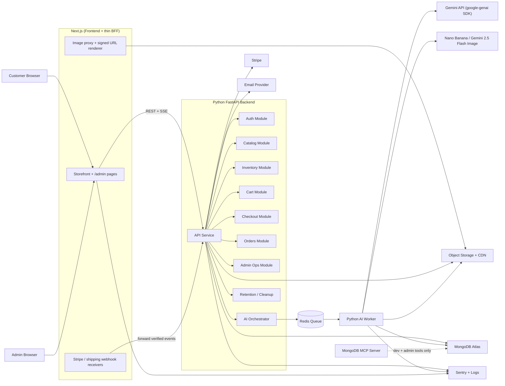
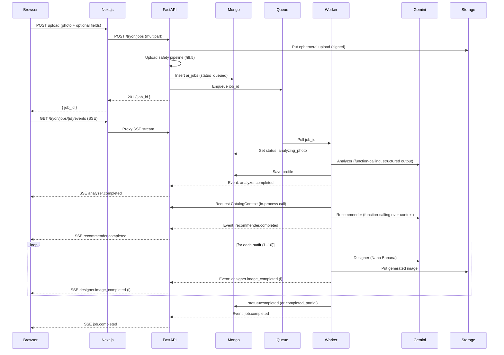
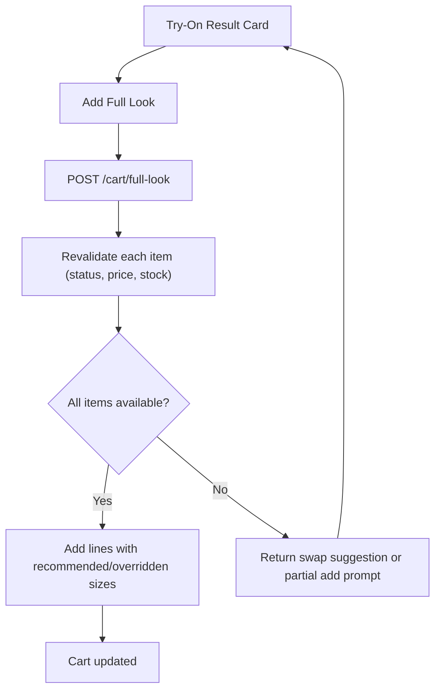
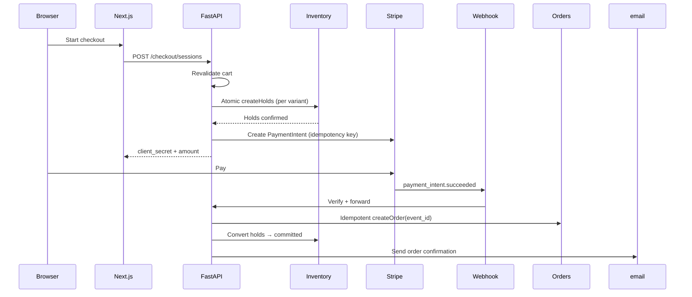

# Architecture — Modern AI-Native Clothing Store

> **Status:** Draft v0.2 — corrected stack + AI implementation
> **Source documents:** `SPECS.md`, `requirements-tracker.xlsx`
> **Owner:** Emmanuel Nyatefe
> **Date:** 2026-05-26

---

## 1. Architecture Goal

Build a single-owner AI-native clothing store where the customer experience starts with a personal try-on, while the commerce core stays dependable, auditable, and recoverable.

The architecture serves two requirements that pull in opposite directions:

- The AI try-on is the differentiator — multimodal, asynchronous, expensive, expressive (`REQ-002`, `REQ-013`, `REQ-052`).
- Orders, payments, inventory, and admin operations are the trust layer — synchronous, transactional, and immune to AI outages (`REQ-063`, `REQ-074`).

We bridge these by splitting the system into a **Next.js frontend** that renders pages and streams progress, and a **Python FastAPI backend** that owns business rules, data, and AI orchestration. Long-running AI work runs in a **separate Python worker** so request timeouts and browser disconnects never kill a generation. This shape is a modular monolith on the backend, not microservices — clean module boundaries inside one FastAPI service, with extraction points if volume forces it later.

---

## 2. Recommended Stack

### 2.1 Phase 1 Default

| Layer | Choice | Reason |
|---|---|---|
| **Frontend app** | Next.js 14+ (App Router) | SSR for product/category SEO (`REQ-077`), server components by default, one app hosting storefront + `/admin/*` routes. |
| **Backend API** | Python 3.12+ + FastAPI | Async-native, REST + SSE in one framework, first-class Gemini SDK, first-class MongoDB driver. Matches AI ecosystem (`REQ-052`, `REQ-070`). |
| **AI worker** | Same Python codebase, separate process | Long-running image generation (`REQ-073`) cannot run inside a request handler; needs its own runtime with its own scaling profile. |
| **Job queue** | Redis-backed (`arq` recommended; `Celery` if richer features are needed later) | Lightweight, async-friendly, supports SSE-friendly progress events, retries, and scheduled cleanup jobs. |
| **Database** | MongoDB Atlas | Variant-level inventory, AI metadata, try-on sessions, and ai_jobs all fit document shape well (`REQ-035`, `REQ-064`). |
| **MongoDB MCP server** | Dev + admin tooling only | Developer ergonomics for catalog exploration and admin-side natural-language queries. **Not** used by customer-runtime AI calls. |
| **Object storage** | S3-compatible bucket + CDN | Product images, ephemeral uploads, generated try-on images, fallback model images (`REQ-066`, `REQ-067`, `REQ-068`). |
| **AI provider** | Google Gemini via `google-genai` Python SDK | Multimodal Analyzer + Recommender (function-calling) + Designer (Gemini 2.5 Flash Image / Nano Banana). Single SDK across all three agent roles. |
| **Payments** | Stripe (default; `OD-003`) | Payment Intents, idempotent webhooks, Stripe Tax option, refunds. |
| **Email** | Resend or SendGrid | Transactional only — order confirmation, guest claim link, password reset, shipping updates (`REQ-092` defers marketing). |
| **Observability** | Sentry + structured JSON logs + provider dashboards | Storefront errors, AI job failures, payment webhook failures, cost/latency tracing (`REQ-075`). |
| **Hosting** | **Deferred** (`OD` to be added) | Choice influences worker runtime and queue. Architecture is intentionally hosting-agnostic. |

### 2.2 Stack Notes

- **Rust is explicitly out.** Python is the runtime for the backend, the worker, and any future ML preprocessing. If a hot path emerges later, wrap it as a service — don't reopen the stack.
- **Next.js does not own the backend.** Next.js owns rendering, the view toggle, image proxying, and the auth shell. Anything that touches the catalog, cart, payment, or AI goes to FastAPI.
- **One FastAPI codebase, two runtimes.** The API process serves HTTP/SSE; the worker process consumes from the queue. Both share models, repositories, and the same Gemini SDK setup.
- **`google-genai` is the unified SDK.** Use a single client (`google-genai`) across Analyzer, Recommender, and Designer rather than mixing older `google-generativeai` and Vertex SDKs. Function-calling is built in and works the same way the Live API does, so future streaming agents won't require a rewrite.

---

## 3. System Overview



The frontend speaks REST + SSE to the backend; the backend speaks SDK-native protocols to providers. The worker is the only thing that holds long-running Gemini calls open.

---

## 4. Application Boundaries

### 4.1 Next.js Frontend

Owns rendering, navigation, and a narrow set of edge-side responsibilities.

| Responsibility | Notes |
|---|---|
| Customer storefront pages | Try-On view, Catalog, PDP, Cart, Checkout, Fitting Room (`REQ-008`–`REQ-026`) |
| Admin panel pages | Products, orders, customers, analytics, audit log viewers (`REQ-006`, `REQ-031`, `REQ-032`) |
| View toggle (Try-On ↔ Catalog) | `localStorage` persistence (`REQ-009`, `REQ-010`) |
| Auth shell | Login forms, session cookie handling, password reset UI (auth logic lives in FastAPI) |
| Image proxy + signed URL surface | Renders product and try-on images via signed CDN URLs; never directly exposes object paths (`REQ-078`) |
| Webhook landing endpoints | Stripe and shipping carrier webhooks land here at the edge, verify signatures, forward verified payloads to FastAPI (`REQ-043`). Optional — can also land directly on FastAPI; choice depends on hosting. |

Frontend rules:

- Catalog and checkout pages must render and function even if the AI service is fully unavailable (`REQ-063`, `REQ-074`).
- Product/category pages are server-rendered with structured data (`REQ-077`).
- Primary commerce actions (`Add to cart`, `Checkout`, `Pay`) use solid high-contrast buttons, not glass surfaces (`REQ-028`).
- The Next.js app never holds business state; refreshing the page does not lose anything beyond what `localStorage` is allowed to keep (`REQ-067`).

### 4.2 Python FastAPI Backend

Owns business rules, data, AI orchestration, and provider integrations.

| Responsibility | Module |
|---|---|
| Auth, sessions, password reset, guest tokens | Auth |
| Products, variants, size charts, AI metadata | Catalog |
| Variant stock, soft holds, last-unit resolution | Inventory |
| Cart state for registered users, cart merge logic | Cart |
| Checkout sessions, tax, shipping, discount, payment intent creation | Checkout |
| Order lifecycle, status transitions, refunds, audit log | Orders |
| Admin CRUD, analytics, AI kill switch and spend controls | Admin Ops |
| Try-on job creation, SSE event streaming, agent coordination | AI Orchestrator |
| Retention/cleanup of ephemeral uploads, expired holds, expired anonymous artifacts | Retention |

Backend rules:

- All clients (frontend, mobile in the future, admin tooling) go through the same FastAPI service. There is no direct browser → MongoDB / Stripe / Gemini path.
- Idempotency keys on every state-changing endpoint that can be retried (`REQ-043`).
- Webhook signatures verified at the edge AND re-verified at the backend before any state change.
- Audit log writes are append-only and live in a separate collection from the audited entity (`REQ-051`).

### 4.3 Python AI Worker

A separate process consuming from the queue. Owns the long-running and budget-sensitive parts of the orchestrator.

Responsibilities:

- Execute each AI agent step in order (Analyzer → Recommender → Designer).
- Stream progress events back to the API service (via Redis pub/sub or queue events) for SSE relay to the browser.
- Retry safe provider failures with backoff; surface unsafe failures immediately.
- Honor the AI kill switch and daily spend ceiling on every step (`REQ-062`, `REQ-072`).
- Persist intermediate results so partial output is recoverable (`REQ-054`).
- Upload generated images to object storage with retention metadata (`REQ-068`).

Worker rules:

- Jobs survive browser disconnect (`REQ-018`). The browser doesn't keep the job alive — the queue does.
- Every Gemini call is bounded by a timeout and a structured failure reason.
- Partial results are a first-class outcome, not a fallback (`REQ-054`).

### 4.4 MongoDB MCP Server

Not a customer-runtime path. Two valid uses only:

- **Developer tooling** — local exploration, debugging recommender behavior, validating data shapes during development.
- **Admin-only tools** — natural-language inventory / order queries in the admin panel, gated behind admin auth and audited like any other admin action.

Customer-facing AI never has arbitrary DB access. The Recommender receives a backend-built `CatalogContext` (see §8.4) that filters to publishable, in-stock, AI-eligible products only.

---

## 5. Core Backend Modules

Each module is a Python package inside the FastAPI service: routers, schemas, repositories, and business logic. Modules talk to each other via internal Python calls in Phase 1; they do not call each other over HTTP.

### 5.1 Auth and Identity

- Customer signup/login/logout, password reset, optional MFA (`REQ-051`, `OD-007`).
- Admin login with separate role checks.
- Guest cart tokens and guest order-management tokens (`REQ-046`).
- Session cookies are HTTP-only, SameSite=Lax, secure in production.
- Customer and admin sessions use separate cookie names and separate auth dependencies in FastAPI.

### 5.2 Catalog

- Products, variants, categories, size charts, product images, AI metadata (`REQ-033`–`REQ-037`).
- Keyword search using MongoDB text indexes (`REQ-021`); semantic search deferred (`REQ-094`).
- Publication and AI-eligibility flags filter what is visible to customers and to the AI.

### 5.3 Inventory

Inventory invariant:

```
available_for_sale(variant)
  = stock_on_hand
  − active_holds
  − committed_units
```

Soft-hold lifecycle (`REQ-040`):

1. Customer starts checkout.
2. Backend revalidates each cart line against current price, status, and stock.
3. Backend creates `inventory_holds` documents with `expires_at = now + 10min` (configurable).
4. Each hold creation uses an atomic `findOneAndUpdate` with a conditional check on `available_for_sale ≥ requested_qty` — two simultaneous attempts cannot both succeed.
5. Payment success converts holds into `committed` and decrements `stock_on_hand`.
6. Payment failure, abandonment, or expiry releases the hold (a scheduled worker job sweeps expired holds).

### 5.4 Cart

- Anonymous cart: stored client-side in `localStorage`, validated server-side on every meaningful action (`REQ-044`).
- Registered cart: stored in the `carts` collection, keyed by customer ID.
- Login merge: when a guest with local items signs in, the backend merges the two carts and returns the combined state (`REQ-044`).
- "Add full look to cart" and per-item add come through the same cart endpoint with different payload shapes (`REQ-014`).

### 5.5 Checkout and Payments

- Creates a Stripe PaymentIntent (or checkout session) after soft holds succeed.
- Webhook handler is idempotent on the Stripe event ID; replay is a no-op (`REQ-043`).
- Order creation and inventory commitment both happen inside the verified webhook handler — not on the browser callback — so a customer closing the tab cannot leave the system in an inconsistent state (`REQ-074`).
- Refunds are issued through Stripe and reflected back into the order document on the refund webhook.

### 5.6 Orders and Fulfillment

Order state machine (`REQ-047`):

```
pending_payment → paid → packed → shipped → delivered
                  ↘
                   cancelled, refunded, partially_refunded,
                   return_requested, returned, exchanged
```

Modification rules (`REQ-049`, `REQ-050`):

- Customer can cancel and edit shipping address while status ≤ `paid`. After `packed`, customer changes require admin action.
- Admin can cancel, refund, and edit address pre-shipment. Adding line items to an existing order is **not** supported — create a linked order (`REQ-095`).
- Every modification writes to the order's audit log.

### 5.7 AI Orchestrator

Owns the workflow; the agents own the provider calls.

Responsibilities:

- Validate try-on eligibility (quota, kill switch, upload safety result).
- Create the `ai_jobs` document with a stable `job_id`.
- Enqueue the job to the worker.
- Expose the SSE endpoint that streams progress events for `job_id` (`REQ-018`).
- Receive worker events, persist them, and relay to subscribed browser(s).
- Enforce partial-result semantics: if Recommender succeeds and Designer fails on 3 of 10 images, return 7 cards (`REQ-054`).



### 5.8 Admin Operations

- Product CRUD, variant/stock management, AI metadata tagging, size chart management (`REQ-031`, `REQ-032`).
- Order management, refunds, support notes, audit log viewer.
- Analytics dashboard: revenue, conversion, top products, AI spend, AI conversion rate, expectation-gap complaints (`REQ-075`).
- AI kill switch + daily spend ceiling controls (`REQ-062`, `REQ-072`).
- Optional MCP-backed natural-language admin query surface (admin-only, audited, see §4.4).

### 5.9 Retention and Cleanup

Scheduled worker jobs:

- Expire and delete anonymous uploads after the 15-minute cap (`REQ-066`).
- Expire signed URLs and delete anonymous generated images at the 24-hour cap (`REQ-068`).
- Release expired inventory holds.
- Garbage-collect orphaned `ai_jobs` rows whose owning session/customer has been deleted.

---

## 6. Data Architecture Overview

Full schema lives in `DATA_MODEL.md` (to be written). The architecture assumes these collections:

| Collection | Purpose |
|---|---|
| `products` | Product-level catalog, AI eligibility, AI metadata, publication state |
| `variants` | SKU, size, color, stock, price overrides |
| `size_charts` | House and per-brand size charts (`OD-012`) |
| `inventory_holds` | Soft checkout holds with `expires_at` |
| `carts` | Registered customer carts |
| `orders` | Order, payment, fulfillment, refund state + audit subdoc |
| `customers` | Registered customer profiles, addresses, consent versions |
| `admin_users` | Admin identity, role, auth metadata |
| `try_on_sessions` | Customer-visible session metadata, links to results |
| `ai_jobs` | Orchestrator job state, progress events, costs, failures |
| `generated_images` | Generated image metadata, signed URL references, retention class |
| `saved_photos` | Opted-in registered customer photos with `photo_uploaded_at`, `photo_consent_version` (`REQ-065`) |
| `audit_logs` | Admin and critical system actions, append-only |
| `webhook_events` | Stripe/shipping webhook idempotency records |
| `analytics_events` | Funnel, AI usage, expectation-gap, conversion |

Ownership rules:

- Catalog and Inventory own product and variant data.
- Orders module is the only thing that writes order state; Checkout creates orders only via the webhook handler.
- AI orchestrator owns `ai_jobs` and `generated_images`.
- Audit logs are append-only and never updated in place.

---

## 7. Storage Architecture

Object storage layout:

```
product-media/                — public via CDN
tryon/uploads/anonymous/      — short-lived, signed access only
tryon/uploads/registered/     — opt-in, signed access only
tryon/generated/anonymous/    — 24h retention, signed URLs
tryon/generated/registered/   — retained until session/account deletion
tryon/fallback-models/        — public, used for hesitant-visitor fallback (REQ-017)
```

Access rules (`REQ-078`):

- All private media uses time-limited signed URLs; no permanent object paths exposed.
- Public product media goes through the CDN with cache-control headers tuned for catalog browsing.
- The retention worker (§5.9) is the only writer that deletes; nothing else issues delete calls against storage.

---

## 8. AI Architecture

### 8.1 SDK and Client Setup

A single `google-genai` Python client is initialized once per worker process and per FastAPI process, configured from environment variables (`GEMINI_API_KEY`, model IDs, default safety settings).

```python
# Conceptual — actual code lives in the AI module
from google import genai

client = genai.Client(api_key=settings.gemini_api_key)

ANALYZER_MODEL    = "gemini-2.5-flash"          # multimodal text + vision
RECOMMENDER_MODEL = "gemini-2.5-flash"          # function-calling over CatalogContext
DESIGNER_MODEL    = "gemini-2.5-flash-image"    # Nano Banana for try-on generation
```

The same client is used by all three agents. Model IDs are config-driven so they can be swapped without code changes.

### 8.2 Agent Pattern

The orchestrator runs each agent as a typed Python function. No external agent framework (LangChain, LangGraph, ADK) is required for Phase 1 — three sequential steps with structured I/O are simpler in plain code, and the worker already gives us retries, persistence, and observability.

| Agent | Pattern | Input | Output |
|---|---|---|---|
| **Analyzer** | Multimodal call with **structured output** schema | Customer photo + optional form (height, fit pref, occasion) | `BodyProfile` Pydantic model: estimated measurements, body shape class, skin undertone, current style notes |
| **Recommender** | Text call with **function-calling** over `CatalogContext` | `BodyProfile` + `CatalogContext` (see §8.4) | `OutfitRecommendation[]` Pydantic models: outfit name, item references (product + variant IDs), size suggestion, rationale |
| **Designer** | Image generation call per outfit | Customer photo + product image references + outfit prompt | Generated try-on image (PNG/JPEG) |

Structured output (`response_schema` in `google-genai`) replaces brittle JSON-parsing-from-prose. Function-calling lets the Recommender express "I want outfits A, B, C" as a structured `propose_outfits(...)` tool call rather than text we have to parse.

### 8.3 AI Job Lifecycle

```
queued
  → validating_upload
  → analyzing_photo
  → building_catalog_context
  → recommending_outfits
  → generating_image_1
  → ...
  → generating_image_10
  → completed | completed_partial | failed | cancelled | expired
```

`ai_jobs` records every transition with timestamp, provider call IDs (where available), and cost estimate. Cost estimate accumulates per step so the daily ceiling can short-circuit before the next image is generated.

### 8.4 CatalogContext Adapter

The contract the Recommender sees. Built by the backend; never exposes raw collections.

```text
CatalogContext {
  customer_profile_summary: <derived from BodyProfile>
  candidates: [
    {
      product_id, variant_ids,
      title, category, fabric_type, formality,
      fit_shape, color_palette, season, price, sale_price,
      available_sizes,           # already filtered to in-stock
      compatibility_tags,        # e.g. ["pairs_with_denim", "layerable"]
      image_references           # for the Designer step
    },
    ...
  ]
  constraints: {
    excluded_product_ids,
    occasion,
    max_outfit_size: 4
  }
}
```

Built by querying `products` + `variants` with filters: `published=true`, `ai_eligible=true`, `available_for_sale > 0`, and category/style matches inferred from the `BodyProfile`. Candidates are capped (e.g. top 60 by relevance) so the Recommender prompt stays bounded.

### 8.5 Upload Safety Pipeline

Runs before the job is enqueued. Reject early, reject loudly.

1. File type / size / dimensions check (`REQ-057`).
2. Content-safety screen via Gemini's safety endpoint or equivalent moderation call.
3. Minor detection — explicit auto-reject if a minor is detected, even if other content is otherwise safe (`REQ-058`).
4. Multi-person check — reject if no primary subject is clear.
5. Quality check — reject blurry, dark, heavily cropped, or low-resolution images.

Only after all five pass does the orchestrator persist the upload and enqueue the job.

### 8.6 SSE Event Types

```
job.created
analyzer.started
analyzer.completed
recommender.started
recommender.completed
designer.image_started        { index }
designer.image_completed      { index, image_url, outfit }
designer.image_failed         { index, reason }
job.completed
job.completed_partial         { successful_count, failed_count }
job.failed                    { reason, recoverable }
```

Each event includes `job_id`, `event_id`, `stage`, `progress_percent` when meaningful, and `timestamp`. The endpoint supports the `Last-Event-ID` request header for reconnect (`REQ-018`).

### 8.7 Cost Controls

The worker checks all of these before each Gemini call (`REQ-062`, `REQ-072`):

- Global AI kill switch (admin-controlled, cached with short TTL).
- Daily spend ceiling.
- Per-anonymous-visitor quota (the lesser of per-IP, per-fingerprint, per-`localStorage`-marker).
- Per-registered-customer weekly quota.
- Rate limits on the upload and generate endpoints.

If any control trips mid-job, the orchestrator emits `job.completed_partial` with the work done so far. The UI surfaces "try-on temporarily unavailable" without breaking catalog shopping (`REQ-063`).

### 8.8 MongoDB MCP — Scoped Usage

The MCP server is a useful tool for natural-language access to MongoDB, but it is not in the customer-runtime path.

| Use | Allowed? | Notes |
|---|---|---|
| Dev sandbox exploration | Yes | Use freely against the dev database |
| Admin natural-language queries | Yes, audited | Admin-auth gated; logged like any admin action |
| Customer-facing Recommender | **No** | Always go through the `CatalogContext` adapter so publication/inventory/privacy rules are enforced |
| Worker reading product images for the Designer | **No** | Use the same repository code the API uses |

---

## 9. Commerce Flow Architecture

### 9.1 Add Full Look to Cart



Rules:

- Never trust stock from generation time (`REQ-055`).
- If one item is gone, the rest are still added; the UI surfaces a swap for the missing one (`REQ-056`).
- Per-item add uses the same endpoint shape with a single line item.

### 9.2 Checkout and Inventory Holds



Failure paths:

- Payment failure releases or lets holds expire; the customer can retry.
- Repeat webhook is a no-op once the order exists for that event ID.
- Expired hold during a retry forces cart revalidation before another PaymentIntent.

---

## 10. Security Architecture

### 10.1 Core Controls (`REQ-078`)

- HTTP-only session cookies, separate for customer and admin.
- CSRF protection on state-changing endpoints reached from the browser.
- Server-side admin authorization on every admin route — no client-only gating.
- Upload validation pipeline (§8.5) before any provider call.
- Rate limiting on auth, upload, AI generation, checkout, and guest-link endpoints.
- Signed URLs everywhere private media is exposed.
- Secrets only in environment variables or a managed secrets store.
- Webhook signatures verified at the receiver AND re-verified at the backend.
- Idempotency keys on payment and order operations.

### 10.2 Guest Links

Guest order-management and account-claim links (`REQ-046`, `REQ-049`):

- Single-purpose, signed, short-lived (7 days for claim, shorter for management actions).
- Rate-limited, logged on use, revocable by admin.
- Never grant full admin order controls — only the specific action they were issued for.

### 10.3 Admin Audit Logging (`REQ-051`)

Audit log entries required for:

- Product create/update/delete
- Variant/stock changes
- Price changes
- AI eligibility / AI metadata changes
- Order status changes, address edits, refunds
- Admin login events
- AI kill switch and spend ceiling changes
- Customer photo / try-on session deletions (admin-initiated)

---

## 11. Observability Architecture

### 11.1 Logs and Events (`REQ-075`)

| Area | Captured |
|---|---|
| AI jobs | `job_id`, `customer_or_session_id`, provider call IDs, latency per step, status, estimated cost, failure reason |
| Payments | `event_id`, `payment_intent_id`, `order_id`, event type, processing result |
| Inventory | Hold create/expire/commit/release, last-unit failures |
| Email | Template, recipient hash, provider ID, delivery status |
| Admin | Actor, action, target, before/after summary |
| Storefront | Funnel events — try-on starts, completes, add-to-cart, checkout conversion |

Structured JSON logs throughout, with `request_id` correlation across Next.js, FastAPI, and the worker.

### 11.2 Admin Analytics

Phase 1 dashboard surfaces: revenue, orders, conversion, top products, low/out-of-stock products, AI spend, try-on starts/completes, AI conversion, failed generations, top recommended products, expectation-gap complaints.

---

## 12. Deployment Architecture

### 12.1 Environments

Dev / Staging / Production. Each gets separate:

- MongoDB cluster (or DB namespace inside a shared cluster for dev)
- Object storage bucket prefix
- Stripe keys + webhook endpoint
- Gemini API key
- Email provider keys
- Redis instance

### 12.2 Runtime Shape

```
[ Next.js Frontend ]   (Node runtime; SSR + a few edge endpoints)
        │
        │ REST + SSE
        ▼
[ FastAPI API Service ]   (Python 3.12+, async, multi-process behind a reverse proxy)
        │
        │ enqueue
        ▼
[ Python AI Worker ]      (Same codebase, separate process — scaled independently)
        │
        ├── google-genai → Gemini (Analyzer / Recommender)
        ├── google-genai → Nano Banana (Designer)
        └── object storage, mongo, redis

Managed providers:
  - MongoDB Atlas
  - S3-compatible storage + CDN
  - Stripe
  - Email provider
  - Sentry
  - Redis (managed or self-hosted)
```

The Next.js app and the FastAPI service are **separate deployments** with their own scaling policies. The worker is also a separate deployment from FastAPI so AI bursts don't starve API requests.

Hosting platform is intentionally not chosen yet (`OD` to be added). The architecture works on any platform that supports long-running Python processes plus a managed Node runtime.

### 12.3 CI/CD

CI runs:

- Type checks (`ruff` + `mypy` for Python, `tsc --noEmit` for Next.js).
- Lint (`ruff`, `eslint`).
- Unit tests (`pytest` for backend, `vitest` or `jest` for frontend).
- API contract tests once `API.md` exists.
- Build for both services.
- Secret scan.

Production deployment requires passing CI, environment variables set, MongoDB index migration plan reviewed, webhook endpoint verification, and a rollback path.

---

## 13. Architecture Decision Records

### ADR-001: Two-Service Split (Next.js + FastAPI)

**Decision:** Next.js owns rendering and the auth shell. FastAPI is the backend for everything else, including the AI orchestrator. The AI worker is a third deployment.

**Reason:**
- Gemini SDK and the broader AI ecosystem are Python-native.
- FastAPI gives us REST + SSE + async in one framework.
- Next.js stays focused on what it's best at — SSR and SEO for product pages.
- Clear team boundary: frontend devs touch Next.js; backend/AI devs touch FastAPI.

**Risk:** Two services means two deployments, two log streams, two environment configs.

**Mitigation:** Keep the API contract documented in `API.md`; share TypeScript types generated from FastAPI Pydantic schemas (e.g. via `openapi-typescript`).

### ADR-002: `google-genai` Unified SDK, Plain-Python Agents

**Decision:** Use the unified `google-genai` Python SDK for all three agents. No agent framework (LangChain, LangGraph, Google ADK) in Phase 1.

**Reason:**
- Three sequential, well-defined steps are simpler in plain code than in a framework graph.
- The worker already provides retries, persistence, and observability.
- Structured output and function-calling in `google-genai` cover the contract needs without extra abstraction.

**Risk:** When Phase 3 features (multi-agent reasoning, tool use across many tools) arrive, we may need a framework.

**Mitigation:** Keep each agent as a pure function so wrapping in a framework later is straightforward.

### ADR-003: Customer-Runtime AI Uses CatalogContext, Not MCP

**Decision:** The Recommender receives a backend-built `CatalogContext`. MongoDB MCP is for dev tooling and admin natural-language tools only.

**Reason:**
- Publication, inventory, and privacy rules must be enforced before products reach the AI.
- A bounded context is faster to debug and cheaper to send to the model.
- An AI with arbitrary DB access is hard to audit.

**Risk:** Context builder must include enough fields for the Recommender to make good choices.

**Mitigation:** Define `CatalogContext` fields explicitly in `DATA_MODEL.md` and version it.

### ADR-004: AI Jobs Are Asynchronous, Worker-Owned

**Decision:** Try-on generation runs through Redis-queued jobs in a separate Python worker. Browser receives SSE updates.

**Reason:**
- Image generation can exceed HTTP timeouts.
- Browser refresh must not kill jobs (`REQ-018`).
- Partial result handling requires persisted job state (`REQ-054`).

**Risk:** More infrastructure than a synchronous endpoint.

**Mitigation:** Start with a simple Redis + `arq` setup; only add features (priority queues, scheduled cleanup) as they earn their place.

### ADR-005: Commerce Core Survives AI Outage

**Decision:** Catalog, cart, checkout, orders, and admin operations have zero hard dependencies on Gemini or the worker.

**Reason:**
- Reliability and revenue.
- AI provider incidents must not stop sales (`REQ-063`, `REQ-074`).

**Risk:** Requires discipline — easy to accidentally introduce a dependency.

**Mitigation:** Catalog Commerce milestone (M2) ships before AI Try-On v1 (M4). The Try-On view degrades to "temporarily unavailable" and the Catalog toggle keeps working.

### ADR-006: Modular Monolith on the Backend

**Decision:** One FastAPI codebase with clear internal module boundaries. No microservices in Phase 1.

**Reason:**
- Faster delivery, fewer deployment boundaries.
- Internal calls inside one process are simpler than HTTP between services.
- The worker is the only thing that's already separated, because it must be.

**Risk:** If AI volume grows quickly, the AI orchestrator may need to split out.

**Mitigation:** Keep module APIs clean enough that the AI orchestrator can be lifted into its own service with minimal disruption.

---

## 14. Open Architecture Decisions

| ID | Decision | Why it matters |
|---|---|---|
| OD-A1 | **Hosting platform** | Determines worker runtime story, queue choice, log aggregation, and edge behavior. |
| OD-A2 | **Job queue specifics** | `arq` (simple, async-native) vs `Celery` (mature, heavier). Affects AI job reliability and ops. |
| OD-A3 | **Auth implementation** | Build vs. use a library (e.g., `fastapi-users`) vs. a hosted provider (Clerk / Auth0). Affects MFA, password reset, admin scoping. |
| OD-A4 | **Webhook receiver location** | Land Stripe/shipping webhooks on Next.js edge first, or directly on FastAPI. Depends on hosting. |
| OD-A5 | **Image storage provider** | S3 vs. R2 vs. provider-native — affects CDN, signed URL behavior, and cost. |
| OD-A6 | **Redis hosting** | Self-managed vs. managed (Upstash / Redis Cloud / provider) — affects worker reliability and SSE relay design. |
| OD-A7 | **TypeScript ↔ Python contract sync** | Auto-generate TS types from FastAPI OpenAPI vs. hand-maintained — affects developer ergonomics. |

These are layered on top of the product-level open decisions tracked in `requirements-tracker.xlsx` (`OD-001` through `OD-014`).

---

## 15. Requirements Coverage Map

Cross-reference of architecture sections to requirements tracker rows. Phase 1 only.

| Requirement(s) | Covered by |
|---|---|
| `REQ-001`–`REQ-007` (scope, users, two-view UX) | §3, §4.1, §5.1 |
| `REQ-008`–`REQ-019` (Try-On / Catalog UI, states, SSE) | §4.1, §5.7, §8 |
| `REQ-020`, `REQ-021`, `REQ-077` (Catalog search + SEO) | §4.1, §5.2 |
| `REQ-022`–`REQ-024` (refinement, link to try-on) | §5.7, §8 |
| `REQ-025`–`REQ-026`, `REQ-046` (returning visitors, claim link) | §5.1, §5.4 |
| `REQ-027`–`REQ-030` (UI direction, glass usage) | §4.1 (rules), `SPECS.md` |
| `REQ-031`–`REQ-032` (admin scope) | §5.8 |
| `REQ-033`–`REQ-037` (product/variant/AI metadata) | §5.2, §6 |
| `REQ-038`–`REQ-040`, `REQ-055`, `REQ-056` (inventory rules, last-unit, OOS during try-on) | §5.3, §5.7, §9.1 |
| `REQ-041` (size auto-suggest) | §8.2 (Recommender), §5.3 |
| `REQ-042`–`REQ-045`, `REQ-049`, `REQ-050` (checkout, cart, order modification) | §5.4, §5.5, §5.6, §9.2 |
| `REQ-047`–`REQ-048` (order state machine, manual returns) | §5.6 |
| `REQ-051`, `REQ-078` (security, admin audit) | §10 |
| `REQ-052`–`REQ-054` (orchestrator, agents, partial results) | §5.7, §8.2, §8.3 |
| `REQ-057`–`REQ-061` (AI safety, disclosure) | §8.5, §4.1 |
| `REQ-062`, `REQ-072`, `REQ-074` (cost controls, kill switch, reliability) | §8.7, §5.8 |
| `REQ-063` (AI outage fallback) | ADR-005, §8.7 |
| `REQ-064`–`REQ-069` (data + retention + image rights) | §6, §7, §5.9 |
| `REQ-070` (integrations) | §2, §3 |
| `REQ-071` (privacy compliance) | §10, §7, §8.5 |
| `REQ-073` (performance targets) | §8.7 (streaming partials), §4.1 (SSR), Hosting open decision |
| `REQ-075` (observability) | §11 |
| `REQ-076` (accessibility) | §4.1 rules |
| `REQ-079` (environments + runbooks) | §12 |
| `REQ-080`–`REQ-095` (out of scope) | Acknowledged; not built |
| `REQ-096`–`REQ-098` (phasing) | `SPECS.md` §11 + this doc's ADRs |
| `REQ-099`–`REQ-103` (acceptance) | `SPECS.md` §12 + §16 below |

---

## 16. Follow-Up Documents

After this architecture is accepted, write:

1. **`DATA_MODEL.md`** — collection-by-collection schema with fields, indexes, retention metadata, audit subdocuments, and the `CatalogContext` versioned contract.
2. **`API.md`** — FastAPI endpoint contracts, request/response Pydantic schemas, SSE event payloads, webhook signatures, error model.
3. **`UI_FLOWS.md`** — page-by-page Next.js flow specs including empty/loading/error states, mobile vs desktop variations, accessibility annotations.
4. **`MILESTONES.md`** — build order mapped one-to-one against `requirements-tracker.xlsx` milestone columns; each requirement gets an owning milestone, a target acceptance criterion, and a verification approach.

---

## 17. Phase 1 Architecture Acceptance Criteria

Architecture is ready for implementation when:

- Every Phase 1 row in `requirements-tracker.xlsx` maps to a module, file, or external integration in §5–§8.
- The two-service split (Next.js + FastAPI + worker) is reflected in the repo layout and deployment plan.
- AI job lifecycle, SSE event types, and reconnect behavior are defined (`REQ-018`, §8.6).
- `CatalogContext` shape is approved before `DATA_MODEL.md` work starts.
- Idempotency approach for payments and order creation is defined and reviewed (`REQ-043`).
- Soft-hold / last-unit resolution is defined (`REQ-040`, §5.3).
- Retention rules for uploads and generated images are defined (`REQ-066`–`REQ-068`, §5.9, §7).
- Admin auth, audit, and AI kill-switch boundaries are defined (`REQ-051`, `REQ-062`, §10).
- All Open Architecture Decisions (§14) have owners and target dates.
