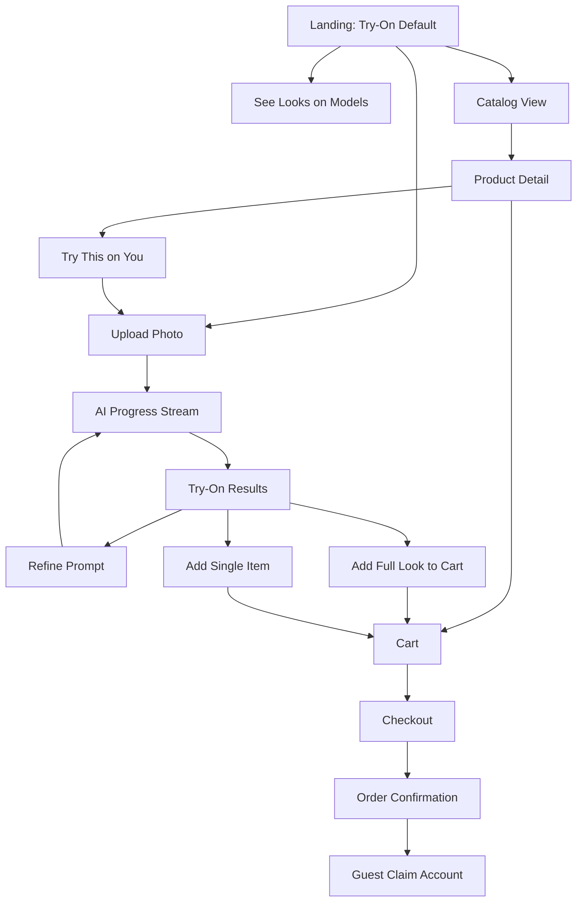

# UI Flows - Modern AI-Native Clothing Store

> **Status:** Draft v0.1 - implementation planning
> **Frontend:** Next.js App Router
> **Source documents:** `SPECS.md`, `ARCHITECTURE.md`, `API.md`
> **Date:** 2026-05-27

---

## 1. Purpose

This document defines the customer and admin UI flows for Phase 1. It is not a pixel-perfect design file. It is the screen/state contract that the design system, components, routes, API integration, and milestone tickets should follow.

The UI direction is:

- **Minimalist luxury commerce foundation** for catalog, product detail, cart, checkout, and admin.
- **Selective liquid glass/glassmorphism** for the AI try-on moments.
- **Clarity over effect** for anything involving price, size, payment, inventory, or admin operations.

---

## 2. Global UI Structure

### 2.1 Public Storefront Shell

Persistent elements:

- Logo / brand mark.
- Header navigation.
- Try-On / Catalog segmented toggle.
- Search entry.
- Account icon.
- Cart icon with count.
- Mobile bottom/floating navigation where useful.

Rules:

- Try-On is default for first-time visitors.
- Toggle persists in `localStorage`.
- Catalog has a direct URL.
- Product/category pages remain crawlable.

### 2.2 Admin Shell

Persistent elements:

- Sidebar or top navigation.
- Store overview.
- Products.
- Orders.
- Customers.
- AI analytics/jobs.
- Settings.
- Audit logs.
- Sign out.

Rules:

- Admin UI is not glass-heavy.
- Dense tables use solid surfaces.
- Destructive actions require confirmation.
- Audit-sensitive changes should show who/when where useful.

---

## 3. Customer Flow Map



---

## 4. Try-On View

### 4.1 Empty State

Shown when:

- First-time visitor.
- Results expired.
- User clicked Start Over.
- Previous job was unrecoverable.

Content:

- Centered upload card.
- One-line value prop: "See clothes on you in 15 seconds."
- Upload CTA.
- Optional refine fields:
  - Height.
  - Fit preference.
  - Occasion.
  - Style prompt.
- Privacy note:
  - Photo goes to AI provider for analysis/generation.
  - Anonymous photo is not kept.
  - 18+ requirement.
- Secondary link: "Not ready to upload? See looks on our models."

Visual:

- Glass upload card over soft fashion/gradient background.
- Solid primary CTA.
- Clear privacy copy.

States:

- Idle.
- Drag-over.
- File selected.
- Uploading.
- Upload rejected.

Upload rejection messages:

- File too large.
- Unsupported file type.
- Image too blurry/dark/cropped.
- Multiple people detected.
- Minor detected.
- Unsafe content.

### 4.2 Loading / AI Progress State

Triggered by:

- Successful upload.
- Saved photo reuse.
- Refine prompt.
- Seeded product try-on.

UI:

- Progress timeline or stepper.
- Human-readable stage messages:
  - Reading your photo.
  - Finding pieces that fit.
  - Styling outfit 1 of 10.
- Partial result area can populate as images complete.
- Cancel/start-over secondary action.

Technical:

- Opens SSE stream from `GET /api/v1/try-on/jobs/{job_id}/events`.
- Supports reconnect with `Last-Event-ID`.
- If job already completed, render cached results.
- If job fails partially, render successful cards.

### 4.3 Results State

Content:

- Up to 10 try-on cards.
- Refine bar above cards.
- Start Over link.
- Disclaimer that images are AI previews/visual approximations.

Card content:

- Generated try-on image.
- "AI preview" badge.
- Outfit name.
- Product list.
- Recommended size per item.
- Size selector per item.
- Bundle total.
- Per-item price.
- Sale/compare-at display.
- Add Full Look to Cart.
- Per-item add button.
- Swap suggestion if item sold out.

Card states:

- Available.
- Partially unavailable.
- Unavailable.
- Added to cart.
- Add failed.
- Rerolling affected outfit.

Accessibility:

- Card image has alt text naming it as AI-generated.
- Product items are accessible as text, not only image overlays.
- Add buttons have explicit labels.

### 4.4 Refine Flow

Input examples:

- "Show warmer pieces."
- "Swap the trousers."
- "Make it semi-formal."

Rules:

- Refine reuses current photo/body profile.
- It does not discard the original session unless Start Over is clicked.
- Results can replace the grid or append a new session version. Phase 1 recommendation: replace the grid but preserve previous version in session history for signed-in users.

---

## 5. Catalog Flow

### 5.1 Catalog Page

Route:

```text
/catalog
```

Content:

- Category tabs or filters.
- Keyword search.
- Size, color, price filters.
- Product grid.
- Sort, if simple.

Product card:

- Product image.
- Title.
- Price/sale price.
- Available colors/sizes summary.
- Add quick action or View Product.
- "Try this on you" link when eligible.

States:

- Loading.
- Empty search.
- No products in category.
- Error loading products.

### 5.2 Product Detail Page

Route:

```text
/products/{slug}
```

Content:

- Product images.
- Title.
- Price.
- Size selector.
- Color selector.
- Stock/availability.
- Description.
- Fit notes.
- Material/care.
- Return eligibility.
- Add to cart.
- Try this on you.

Rules:

- Add to cart requires valid variant selection.
- Try this on you seeds the try-on flow with the product.
- Product media remains crisp; glass overlays should not blur product detail.

---

## 6. Cart and Checkout Flow

### 6.1 Cart

Route:

```text
/cart
```

Content:

- Line items.
- Product/variant details.
- Quantity controls.
- Remove action.
- Price summary.
- Stale item warnings.
- Checkout CTA.

Rules:

- Before checkout, cart revalidates.
- Out-of-stock/unpublished/repriced items are clearly shown.
- Registered cart is server-backed.
- Anonymous cart is local but validated by backend.

### 6.2 Checkout

Route:

```text
/checkout
```

Steps:

1. Contact/guest email or signed-in account.
2. Shipping address.
3. Delivery/shipping method.
4. Discount code.
5. Review totals.
6. Payment.

Rules:

- Soft inventory holds are created when checkout starts.
- Payment buttons are solid and high-contrast.
- Checkout does not use low-contrast glass surfaces.
- Failed payment keeps cart recoverable.
- Expired hold forces cart revalidation.

### 6.3 Confirmation

Route:

```text
/order-confirmation/{order_id}
```

Content:

- Order number.
- Email confirmation status.
- Order summary.
- Shipping address.
- Guest account claim CTA if guest.
- Manage order link.

---

## 7. Account and Fitting Room

### 7.1 Account Home

Route:

```text
/account
```

Content:

- Profile summary.
- Order history.
- Saved addresses.
- Fitting Room link.
- Saved photo status.
- Delete saved photo action.

### 7.2 Fitting Room

Route:

```text
/account/fitting-room
```

Content:

- Grid of past try-on sessions.
- Representative card per session.
- Start a new try-on.
- Use my saved photo.

Session detail:

```text
/account/fitting-room/{try_on_session_id}
```

Actions:

- View cards.
- Add look/item to cart.
- Refine.
- Delete session.

Rules:

- Deleting a session deletes generated images and related profile data for that session.
- Saved photo use requires explicit opt-in.

---

## 8. Guest Order Management

Route:

```text
/guest/orders/{order_id}?token=...
```

Content:

- Order summary.
- Current status.
- Cancel order if allowed.
- Edit shipping address if allowed.
- Claim order into account.

Rules:

- Link is signed, short-lived, and rate-limited.
- If expired, show support contact path.
- No guest link exposes admin controls.

---

## 9. Admin Flows

### 9.1 Admin Dashboard

Route:

```text
/admin
```

Content:

- Revenue.
- Orders.
- Conversion rate.
- Top products.
- Low stock.
- AI spend.
- Try-on starts/completions.
- Failed generations.
- Expectation-gap complaints.

### 9.2 Products Admin

Routes:

```text
/admin/products
/admin/products/new
/admin/products/{product_id}
```

Fields:

- Basic product data.
- Status/publication.
- Pricing.
- Images.
- Variants.
- Size chart.
- Product measurements.
- Material/care.
- Return eligibility.
- AI eligibility.
- AI metadata.

Critical states:

- Draft.
- Published.
- Archived.
- Unsaved changes.
- Delete confirmation.

### 9.3 Orders Admin

Routes:

```text
/admin/orders
/admin/orders/{order_id}
```

Content:

- Order list with filters.
- Order detail.
- Customer/guest info.
- Payment state.
- Fulfillment state.
- Line items.
- Refunds.
- Support notes.
- Audit trail.

Actions:

- Update status.
- Edit shipping address pre-shipment.
- Issue full/partial refund.
- Mark return requested/returned/exchanged.
- Add support note.

Rules:

- Destructive actions require confirmation.
- Refund actions show amount and irreversible warning.
- Every change writes audit log.

### 9.4 AI Admin

Routes:

```text
/admin/ai
/admin/ai/jobs
/admin/ai/jobs/{job_id}
```

Content:

- AI spend.
- Try-on volume.
- Conversion from try-on.
- Failed jobs.
- Top recommended products.
- Provider latency/failure summary.
- Kill switch.
- Daily spend ceiling.
- Anonymous and registered caps.

### 9.5 Audit Logs

Route:

```text
/admin/audit-logs
```

Filters:

- Actor.
- Action.
- Target type.
- Date range.

---

## 10. Responsive Rules

Mobile:

- Try-on results are 1-column with swipe-friendly cards.
- Upload zone full width.
- Header toggle compresses to icons.
- Checkout steps are single-column.

Tablet:

- Try-on results are 2-column.
- Catalog grid 2-3 columns.

Desktop:

- Try-on results are 3-4 columns.
- Catalog grid 4 columns when space allows.
- Admin uses tables where appropriate.

---

## 11. Error, Empty, and Loading States

Required states:

- AI unavailable.
- AI budget exhausted.
- Upload rejected.
- Partial generation.
- Catalog empty.
- Search empty.
- Product out of stock.
- Cart stale.
- Payment failed.
- Checkout hold expired.
- Guest link expired.
- Admin permission denied.
- Refund failed.

Rule:

- Every error state should explain what happened and provide one next action.

---

## 12. UI Acceptance Criteria

UI flow planning is complete when:

- Every Phase 1 customer route has empty/loading/error/success states.
- Try-On, Catalog, Cart, Checkout, Account, Fitting Room, and Admin flows map to API endpoints.
- Glassmorphism usage is limited to the intended AI surfaces.
- Checkout and admin remain readable and high-contrast.
- Mobile behavior is specified for all primary customer flows.
- Accessibility requirements are reflected in image labels, keyboard flow, focus states, and non-image text.
